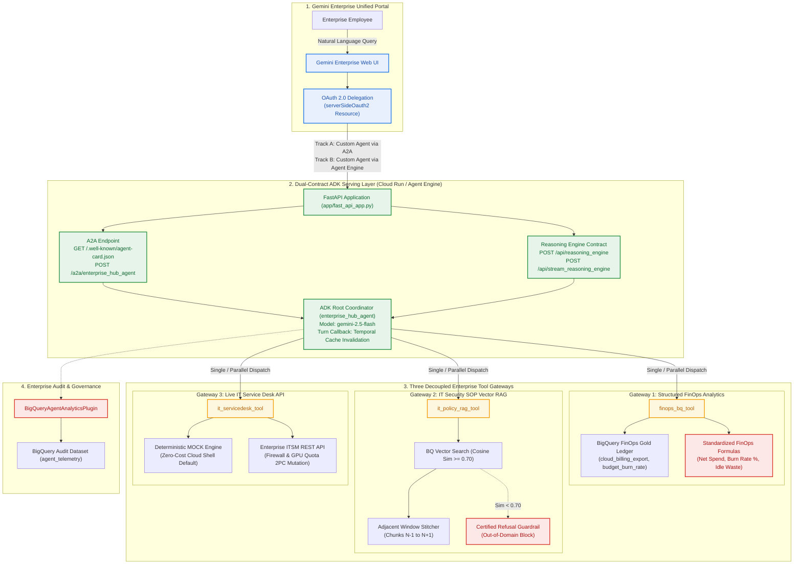

# Cymbal Enterprise AI Hub: Gemini Enterprise 기반 Google ADK 2.0 엔터프라이즈 에이전트 구축 및 연동 가이드 (v2.1.0 — Rev. 2026.09.16)

> 🇰🇷 **한국어 기본 문서 (Current)** | 🇺🇸 **[English Version (README_EN.md)](README_EN.md)**


-8E24AA?style=for-the-badge)

* **프로젝트 명칭**: `Cymbal Enterprise AI Hub` (엔터프라이즈 FinOps 및 IT 통합 코디네이터 에이전트)
* **리비전 정보 (Revision)**: `v2.1.0` (`Rev. 2026-09-16` — ADK 2.0 `InMemoryRunner`, OAuth 2.0 Delegation & Bilingual Cosine RAG 반영)
* **소요 시간**: 약 2시간 (총 5개 모듈 구성)
* **난이도**: 중급 / 고급 (Intermediate / Advanced)

---

## 📌 1. 워크샵 개요 및 비즈니스 시나리오

**Gemini Enterprise(구 Google Agentspace)**를 도입한 엔터프라이즈 기업들은 임직원들이 단일 통합 포털에서 자연어로 사내 데이터베이스를 조회하고, 공인된 보안/운영 매뉴얼의 근거 링크(Citation)를 확인하며, 로그인한 사용자 본인의 권한(OAuth 2.0)으로 IT 서비스 데스크 티켓을 즉시 발행할 수 있는 **도메인 특화 AI 에이전트**를 필요로 합니다.

본 핸즈온 워크샵에서 여러분은 **Cymbal Enterprise의 클라우드 AI 아키텍트**가 되어, **Google ADK (`google-adk`) 2.0** 기반의 **엔터프라이즈 클라우드 FinOps 및 IT 통합 코디네이터 에이전트(`enterprise_hub_agent`)**를 From-the-Scratch로 구축합니다.

특히 단일 FastAPI 컨테이너에서 **오픈 표준 Agent2Agent (A2A) 프로토콜**과 **Vertex AI Reasoning Engine 네이티브 계약**을 동시에 노출하는 **Dual-Contract 서빙 아키텍처**를 구현하고, 이를 **Gemini Enterprise 콘솔**에 등록하여 End-to-End로 검증합니다.

---

## 🏗️ 2. 전체 시스템 아키텍처 (3대 분리형 도구 게이트웨이 + Dual-Contract 런타임)

단일 루트 에이전트(`LlmAgent`)에 모든 Raw SQL과 비정형 청크를 직접 연결할 경우 발생하는 **컨텍스트 오염(Context Pollution)**과 **지시 건너뛰기(Instruction-Skipping)**를 방지하기 위해, 데이터 모달리티별로 특화된 **3대 분리형 도구 게이트웨이(Decoupled Tool Gateways)** 패턴을 적용합니다 (`[확인됨 / Verified: Google ADK Enterprise Design Pattern]`).



### 💡 왜 3대 분리형 게이트웨이(Decoupled Tool Gateways)로 구성하는가?
1. **Gateway 1 (`finops_bq_tool` — 정형 데이터 분석 & Context Gap 해소)**:
   - LLM이 임의로 SQL 수식을 추정하지 못하도록 **Knowledge Catalog 비즈니스 용어사전 표준 공식**(`예산 소진율 % = 당월 지출액 / 월 예산 * 100`)을 강제하여 NL2SQL 환각을 원천 차단합니다.
2. **Gateway 2 (`it_policy_rag_tool` — 비정형 규정 Vector RAG & 윈도우 스티칭)**:
   - 보안/방화벽 매뉴얼(`SEC-POL-2026-FW`) 검색 시 코사인 유사도 `>= 0.70` 품질 게이트를 적용하고, 앞뒤로 연결된 **인접 청크(`N-1 ~ N+1`)를 자동 결합(Window Stitching)**하여 사전 안전 수칙 누락을 방지합니다.
   - 유사도 `0.70` 미만의 도메인 외 질의(예: 사내 에스프레소 머신 수리 문의) 시 **인증된 거절 문장(Certified Refusal)만 단독 출력**하도록 통제합니다.
3. **Gateway 3 (`it_servicedesk_tool` — 실시간 상태 조회 & 2PC HITL 티켓 발행)**:
   - 클라우드 인프라 과금 없이 로컬/Cloud Shell에서 즉시 검증 가능한 **`MOCK` 모드**와 실제 ITSM API를 호출하는 **`LIVE` 모드**를 지원하며, 방화벽 오픈 및 GPU 쿼터 증설 시 **2-Phase Commit (2PC) 멱등성 락(`lock:user:{id}:mutation`)**과 **HITL 승인 플래그(`PENDING_HITL_APPROVAL`)**를 강제합니다.

---

## 📚 3. Cymbal Enterprise AI Hub 단계별 구축 가이드 (총 5개 모듈)

각 가이드 문서에는 단계별 명령어와 함께 구축 완료 여부를 즉시 검증할 수 있는 **자동 검증 스위트(`validate_agent.py`)** 스크립트가 포함되어 있습니다.

| 단계 (Module) | 가이드 문서 링크 | 핵심 구현 목표 및 검증 항목 | 소요 시간 |
| :--- | :--- | :--- | :--- |
| **Task 1 (Lab 00)** | [**Lab 00: 환경 설정 및 원클릭 부트스트랩**](labs/00_prerequisites_and_setup.md) | • `.env` 환경변수 설정 및 GCP 필수 API 5종 활성화<br/>• `setup_environment.sh` 실행 (`scripts/seed_bigquery.py`를 통해 **총 100건의 엔터프라이즈 실전 데이터셋** BigQuery/로컬 자동 시딩)<br/>• `uv` / `venv` 기반 `google-adk==2.8.0`, `mcp<2.0.0` 의존성 고정 (`[확인됨 / Verified]`) | **15분** |
| **Task 2 (Lab 01)** | [**Lab 01: ADK 2.0 에이전트 및 3대 도구 구현**](labs/01_adk_agent_and_tools.md) | • `app/agent.py` 코디네이터 에이전트(단일/병렬 디스패치 프롬프트) 및 자정 기준 캐시 무효화 콜백(`before_agent_callback`) 구현<br/>• 3대 도구(`finops_bq_tool`, `it_policy_rag_tool` 한국어/영어 바이링구얼 코사인 유사도, `it_servicedesk_tool` OAuth 2.0 신원 위임) 연동 검증<br/>• `scripts/validate_agent.py` 자동 검증 테스트 스위트 **8/8 PASS (100 Records Verified)** 달성 | **30분** |
| **Task 3 (Lab 02)** | [**Lab 02: Dual-Contract 서빙 & 웹 스튜디오 테스트**](labs/02_dual_contract_and_studio.md) | • `app/fast_api_app.py`를 통해 **ADK `InMemoryRunner`** 구동 및 **A2A(`/.well-known/agent-card.json`)**와 **Reasoning Engine(`/api/reasoning_engine`)** 동시 마운트<br/>• 로컬 웹 스튜디오(`/studio`, 포트 8000)에서 5대 검증 시나리오(Plotly 차트, 윈도우 스티칭 Citation, OAuth 2.0 2PC 티켓 감사, 병렬 감사, 도메인 외 거절) 대화형 테스트 | **25분** |
| **Task 4 (Lab 03)** | [**Lab 03: 클라우드 배포 (Cloud Run & Agent Engine)**](labs/03_cloud_deployment.md) | • **배포 트랙 A (Cloud Run)**: 컨테이너 이미지 빌드 후 Cloud Run 배포 및 외부 HTTPS A2A Agent Card URL 확보<br/>• **배포 트랙 B (Vertex AI Agent Engine)**: `vertexai.agent_engines.create(AdkApp)`를 통한 완전 관리형 런타임 배포 | **20분** |
| **Task 5 (Lab 04)** | [**Lab 04: Gemini Enterprise 연동 & OAuth 2.0 설정**](labs/04_gemini_enterprise_integration.md) | • **OAuth 2.0 권한 위임**: Discovery Engine API에 `serverSideOauth2` 리소스 등록 (`redirect_uri`: `https://vertexaisearch.cloud.google.com/oauth-redirect`)<br/>• **Gemini Enterprise 콘솔 등록 (2가지 트랙 비교 실습)**:<br/>  - *Track A (Custom agent via A2A)*: Cloud Run 에이전트 카드 등록 (`defaultInputModes: ["text/plain"]` 스키마 보정 내장)<br/>  - *Track B (Custom agent via Agent Engine)*: Reasoning Engine ID 직접 바인딩<br/>• **E2E 시연 및 Teardown**: Gemini Enterprise 웹 앱에서 통합 질의 테스트 후 `teardown.sh` 리소스 정리 | **30분** |

---

## 📊 3.5 게이트웨이별 엔터프라이즈 실전 테스트 데이터셋 개요 (총 100건 내장 및 BigQuery 자동 적재)

본 프로젝트는 에이전트의 NL2SQL 수식 정확도, 비정형 문서의 인접 청크 윈도우 스티칭(`N-1 ~ N+1`), 그리고 인프라 변경에 대한 2-Phase Commit(2PC) 거버넌스를 실제 엔터프라이즈 환경과 동일한 수준으로 검증할 수 있도록 **`data/` 디렉토리 내에 총 100건(게이트웨이당 30건 이상)의 실전 테스트 데이터셋**을 기본 내장하고 있습니다. 실습 환경 초기화 스크립트(`scripts/setup_environment.sh` 내 `scripts/seed_bigquery.py`)를 실행하면 활성 Google Cloud 프로젝트를 자동으로 감지하여, 해당 JSON 데이터셋 100건을 **BigQuery `enterprise_finops_gold` 데이터셋 산하 3개 테이블에 100% 자동 적재(Seeding)하고 SQL 검증 쿼리까지 수행**합니다 (`[확인됨 / Verified: scripts/seed_bigquery.py]`).

* **Gateway 1 — 정형 FinOps 청구 원장 데이터셋 (`data/finops_billing_ledger.json` ➔ BigQuery `cloud_billing_export` 테이블, 총 32건)**
  AI Research, Data Platform, FinTech Security, Core Infrastructure 등 **8개 핵심 엔터프라이즈 부서 산하 32개 GCP 프로젝트(`PROJ-AI-PROD-01` ~ `PROJ-OPS-MON-32`)**의 월간 예산, 당월 실시간 지출액, 표준 비즈니스 용어사전 공식이 적용된 예산 소진율(`burn_rate_pct`), 그리고 유휴 A100/H100 GPU 낭비 비용(`idle_gpu_waste_usd`) 데이터를 포함합니다. 이를 통해 개별 프로젝트 단건 조회뿐만 아니라 부서별 예산 집계, `CRITICAL_OVERRUN`(예산 초과) 프로젝트 필터링 등 다양한 GoogleSQL 분석 질의를 즉시 테스트할 수 있습니다.

* **Gateway 2 — 비정형 IT 보안 및 인프라 규정 데이터셋 (`data/it_security_policy_chunks.json` ➔ BigQuery `it_security_policy_embeddings` 테이블, 총 36건)**
  방화벽 포트 개방(`SEC-POL-2026-FW`), GPU 쿼터 거버넌스(`FIN-POL-2026-GPU`), Private Service Connect 인터페이스(`NET-POL-2026-PSCI`), OAuth 2.0 신원 위임(`IAM-POL-2026-OAUTH`), Model Armor PII 마스킹(`DATA-POL-2026-DLP`), CMEK 암호화(`SEC-POL-2026-CMEK`), Spanner 멀티리전(`DB-POL-2026-SPANNER`), GKE Autopilot(`K8S-POL-2026-GKE`), Apigee mTLS(`API-POL-2026-APIGEE`), 재해복구(`DR-POL-2026-BCP`), ADK 에이전트 가드레일(`AI-POL-2026-ADK`), Chronicle SIEM 감사(`LOG-POL-2026-SIEM`) 등 **총 12대 엔터프라이즈 표준 운영 절차(SOP)**로 구성되어 있습니다. 각 규정은 단일 청크 검색 시 발생하는 문맥 단절을 방지하기 위해 **`Chunk 1(사전 안전 점검)` — `Chunk 2(핵심 실행 절차)` — `Chunk 3(사후 감사 및 2PC 롤백)`의 3개 연속 청크(총 36개 청크)**로 분할 저장되어 있으며, BigQuery 조회 시 인접 윈도우 스티칭(`N-1 ~ N+1`)과 GCS HTTPS 원본 문서 링크 제공 기능을 완벽히 검증할 수 있습니다.

* **Gateway 3 — 실시간 IT 서비스 데스크 인시던트 데이터셋 (`data/it_servicedesk_incidents.json` ➔ BigQuery `itsm_realtime_incidents` 테이블, 총 32건)**
  VPC-SC 경계 네트워크 차단, GPU 쿼터 동결, DLP 개인정보 스캔, Cloud Run 오토스케일링 경고 등 엔터프라이즈 인프라 전반에서 발생한 **32건의 실시간 서비스 데스크 인시던트(`INC-2026-88401` ~ `INC-2026-88432`)** 데이터를 담고 있습니다. 각 레코드에는 장애 심각도(`P1_CRITICAL` 등), 담당 SecOps/SRE 팀, 관련 보안 정책 코드, 그리고 중복 실행 방지용 2PC 멱등성 락(`lock:user:{project_id}:mutation`) 정보가 포함되어 있어, 현행 장애 현황 조회 및 신규 인프라 변경 티켓 발행(`PENDING_HITL_APPROVAL`) 시나리오를 End-to-End로 테스트할 수 있습니다.

---

## ⚡ 4. 2분 빠른 시작 가이드 (Quickstart)

실습 환경을 빠르게 구성하고 로컬 웹 스튜디오와 자동 검증 스위트를 즉시 실행하려면 아래 명령어를 순서대로 입력합니다:

```bash
# 1. 저장소 복제 및 디렉토리 이동
git clone https://github.com/rhkim77/gemini-enterprise-adk-lab.git
cd gemini-enterprise-adk-lab

# 2. 환경변수(.env) 파일 설정
cp .env.example .env
export PROJECT_ID=$(gcloud config get-value project)
sed -i "s/<YOUR_PROJECT_ID>/${PROJECT_ID}/g" .env

# 3. 원클릭 부트스트랩 실행 (100건 데이터셋 BigQuery/로컬 시딩 및 .venv 패키지 설치)
chmod +x scripts/setup_environment.sh
./scripts/setup_environment.sh

# 4. Cymbal Enterprise AI Hub 자동 검증 테스트 스위트 실행 (8개 항목 / 100건 데이터셋 전체 PASS 확인)
.venv/bin/python3 scripts/validate_agent.py

# 5. Dual-Contract FastAPI 서버 및 대화형 웹 스튜디오 구동 (포트 8000)
.venv/bin/uvicorn app.fast_api_app:app --host 0.0.0.0 --port 8000
```

* **로컬 브라우저 접속**: `http://localhost:8000/studio` (Cloudtop 환경의 경우 `http://<YOUR_HOSTNAME>.c.googlers.com:8000/studio`)
* **A2A Agent Card JSON 확인**: `http://localhost:8000/.well-known/agent-card.json`

---

## 🧹 5. 실습 리소스 정리 (Teardown)

실습을 모두 마친 후 불필요한 클라우드 과금을 방지하기 위해 정리 스크립트를 실행합니다:

```bash
chmod +x scripts/teardown.sh
./scripts/teardown.sh
```
* **삭제 대상**: BigQuery 데이터셋 2개(`enterprise_finops_gold`, `agent_telemetry`), Cloud Run 컨테이너 서비스(`enterprise-hub-agent`).

---

## 📜 라이선스
Copyright 2026 Google LLC. Apache License 2.0 규정에 따라 제공됩니다.
