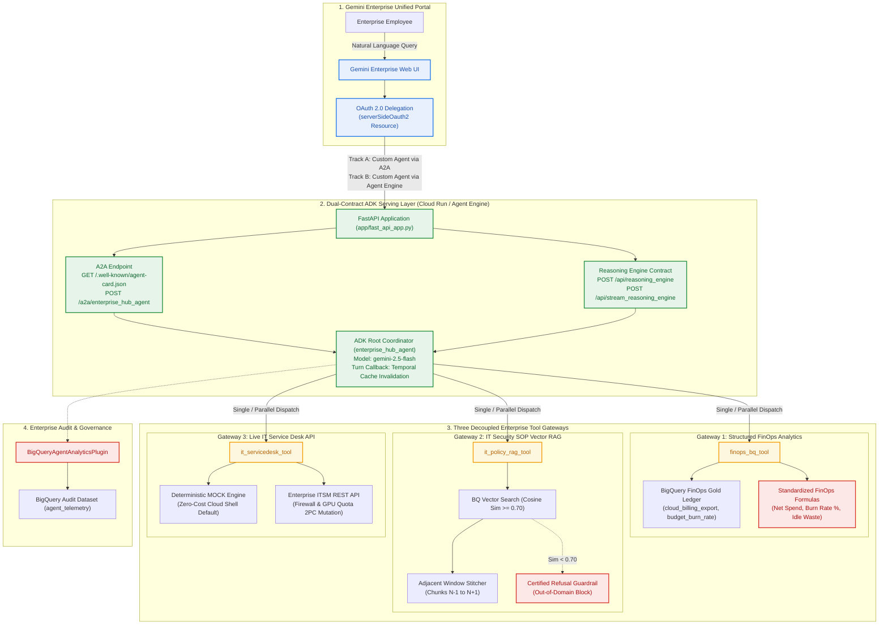

# Cymbal Enterprise AI Hub: Building & Registering an Enterprise ADK 2.0 Agent in Gemini Enterprise (v2.1.0 — Rev. 2026.09.16)

> 🇰🇷 **[한국어 기본 문서 보기 (README.md)](README.md)** | 🇺🇸 **English Version (Current)**


-8E24AA?style=for-the-badge)

* **Revision**: `v2.1.0` (`Rev. 2026-09-16` — Genuine ADK 2.0 `InMemoryRunner`, OAuth 2.0 Delegation & Bilingual Cosine RAG)
* **Duration**: 2 Hours (120 Minutes)
* **Level**: Intermediate / Advanced
* **Lab Format**: Hands-on Cloud Skills Lab (Enterprise Production Architecture)
* **Structural Reference**: Modeled after [hajekim/build-with-gemini-day1-agent](https://github.com/hajekim/build-with-gemini-day1-agent)

---

## 📌 Lab Overview & Business Scenario

Enterprise organizations adopting **Gemini Enterprise (formerly Google Agentspace)** need to empower employees with custom, domain-specific AI agents that can securely query internal databases, retrieve corporate policies with verified citations, and execute IT/FinOps workflows on behalf of the logged-in user.

In this hands-on lab, you act as a **Cloud Enterprise Architect** for **Cymbal Enterprise**. You will build, test, deploy, and register the **Enterprise FinOps & IT Hub Coordinator Agent (`enterprise_hub_agent`)** using **Google ADK (`google-adk`) 2.0**, exposing it to **Gemini Enterprise** via both **Native Vertex AI Agent Engine** and the open-standard **Agent2Agent (A2A) Protocol**.

---

## 🏗️ End-to-End Architecture (3 Decoupled Tool Gateways + Dual-Contract Runtime)



---

## 📚 Lab Curriculum & Tasks (Step-by-Step Guide)

| Task | Lab Guide Link | Core Objectives & Deliverables | Duration |
| :--- | :--- | :--- | :--- |
| **Task 1 (Lab 00)** | [**00: Environment Setup & One-Click Bootstrap**](labs/00_prerequisites_and_setup.md) | Configure `.env`, enable GCP APIs, run `setup_environment.sh` to create BigQuery FinOps & IT Policy tables, and pin `google-adk==2.8.0` & `mcp==1.29.1`. | 15 mins |
| **Task 2 (Lab 01)** | [**01: ADK 2.0 Agent & 3 Decoupled Tool Gateways**](labs/01_adk_agent_and_tools.md) | Implement `enterprise_hub_agent` (`app/agent.py`), build the 3 specialized gateways (`finops_bq_tool`, `it_policy_rag_tool` with `N-1~N+1` window stitching & refusal guardrail, `it_servicedesk_tool`), and pass `validate_agent.py`. | 30 mins |
| **Task 3 (Lab 02)** | [**02: Dual-Contract Serving & Local Studio Test**](labs/02_dual_contract_and_studio.md) | Mount both A2A (`/.well-known/agent-card.json`) and Reasoning Engine (`/api/reasoning_engine`) contracts on FastAPI, test 4 scenarios in Web Studio (`/studio`), and inspect BigQuery telemetry logs. | 25 mins |
| **Task 4 (Lab 03)** | [**03: Cloud Deployment (Cloud Run & Agent Engine)**](labs/03_cloud_deployment.md) | Deploy the Dual-Contract container to **Google Cloud Run** (`gcloud run deploy`) and/or **Vertex AI Agent Engine** (`AdkApp`), verifying live endpoints via `curl`. | 20 mins |
| **Task 5 (Lab 04)** | [**04: Gemini Enterprise Integration & OAuth 2.0**](labs/04_gemini_enterprise_integration.md) | Register OAuth 2.0 `serverSideOauth2` resource in Discovery Engine, register the agent in **Gemini Enterprise Console** via **Track A (A2A)** and **Track B (Agent Engine)**, run E2E employee queries, and execute `teardown.sh`. | 30 mins |

---

## ⚡ 2-Minute Quickstart

```bash
# 1. Configure Environment
cp .env.example .env
export PROJECT_ID=$(gcloud config get-value project)
sed -i "s/<YOUR_PROJECT_ID>/${PROJECT_ID}/g" .env

# 2. Run One-Click Bootstrap (Creates BigQuery datasets/tables & Python venv via Corp Airlock)
chmod +x scripts/setup_environment.sh
./scripts/setup_environment.sh

# 3. Run Automated Validation Suite (Verifies all 3 gateways + refusal guardrail)
source .venv/bin/activate
python3 scripts/validate_agent.py

# 4. Launch Local Dual-Contract Server & Web Studio UI
uvicorn app.fast_api_app:app --host 0.0.0.0 --port 8000
```
Open `http://localhost:8000/studio` in your browser to test the agent interactively.
