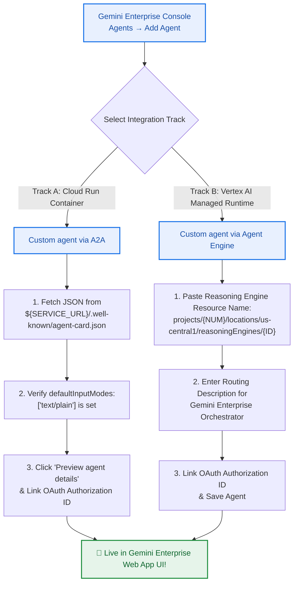

# Lab 04 (Task 5): Gemini Enterprise 연동, OAuth 2.0 권한 위임 및 E2E 검증

* **실습 ID**: `Cymbal Enterprise AI Hub` — Task 5 / 5 (Capstone Task)
* **소요 시간**: 약 30분
* **난이도**: 고급 (Advanced)

---

## 🎯 실습 목표 (Objectives)

이번 최종 Capstone Task에서는 다음 작업을 수행합니다:
1. Gemini Enterprise가 로그인한 임직원의 신원(Identity)을 ADK 에이전트에 안전하게 위임할 수 있도록 **Discovery Engine API (`discoveryengine.googleapis.com`)**에 **OAuth 2.0 `serverSideOauth2` Authorization 리소스**를 등록합니다 (`[확인됨 / Verified: How to register and use ADK Agents with Gemini Enterprise.pdf]`).
2. **Gemini Enterprise 콘솔**에서 에이전트를 등록하는 **2가지 핵심 트랙**을 비교 실습합니다:
   - **Track A: Custom Agent via A2A 프로토콜** (Cloud Run `agent-card.json` 활용)
   - **Track B: Custom Agent via Agent Engine** (Vertex AI Reasoning Engine Resource ID 바인딩)
3. **Gemini Enterprise 웹 앱 통합 UI**에서 사내 임직원 시나리오를 End-to-End로 테스트하고, 엔터프라이즈 보안 하드닝(VPC-SC / PSC-I / Squid Proxy) 체크리스트를 점검합니다.
4. 실습 완료 후 `scripts/teardown.sh`로 모든 과금 리소스를 정리합니다.

---

## 🔐 Step 1: Discovery Engine에 OAuth 2.0 Authorization 리소스 등록

사내 임직원이 Gemini Enterprise 채팅창에서 *"내 프로젝트 예산 소진율 확인해 줘"* 또는 *"방화벽 오픈 티켓 생성해 줘"*라고 요청할 때, 백엔드 에이전트는 해당 임직원의 OAuth 2.0 권한 범위(ACL) 내에서 동작해야 합니다.

### 1.1 사전 작업: Google Cloud Console에서 OAuth Redirect URI 등록
1. **Google Cloud Console → APIs & Services → Credentials (사용자 인증 정보)** 메뉴로 이동합니다.
2. **OAuth 2.0 클라이언트 ID**(웹 애플리케이션 유형)를 생성하거나 기존 클라이언트를 편집합니다.
3. **승인된 리디렉션 URI (Authorized redirect URIs)** 항목에 반드시 아래 **Gemini Enterprise 공식 리디렉션 주소**를 추가해야 합니다 (`[확인됨 / Verified]`):
   ```text
   https://vertexaisearch.cloud.google.com/oauth-redirect
   ```
4. 발급된 `Client ID`와 `Client Secret`을 복사합니다.

### 1.2 Discovery Engine Authorization 등록 스크립트 실행
`scripts/register_oauth_discovery_engine.sh` 스크립트를 실행하여 `serverSideOauth2` 리소스를 등록합니다:

```bash
export PROJECT_ID=$(gcloud config get-value project)
export AUTH_ID="enterprise-hub-oauth-auth"
export OAUTH_CLIENT_ID="YOUR_CLIENT_ID.apps.googleusercontent.com"
export OAUTH_CLIENT_SECRET="YOUR_CLIENT_SECRET"

chmod +x scripts/register_oauth_discovery_engine.sh
./scripts/register_oauth_discovery_engine.sh
```

> **📌 리소스 이름 기록**: 출력된 `projects/${PROJECT_ID}/locations/global/authorizations/enterprise-hub-oauth-auth` 경로를 복사해 둡니다. Step 2에서 에이전트 등록 시 연결합니다.

---

## 🚀 Step 2: Gemini Enterprise 콘솔에서 ADK 에이전트 등록 (Dual-Track 비교 실습)

**Google Cloud Console → Gemini Enterprise (Agent Builder / Agentspace)**로 이동하여 대상 Enterprise Application을 선택한 뒤, 좌측 메뉴의 **[Agents (에이전트)] → [Add agent (에이전트 추가)]**를 클릭합니다.

배포 환경에 따라 **Track A (A2A 프로토콜)** 또는 **Track B (Native Agent Engine)** 중 하나를 선택하여 등록할 수 있습니다.



---

### 🅰️ Track A: A2A 프로토콜로 등록 (`Custom agent via A2A`)
1. 에이전트 유형에서 **"Custom agent via A2A"**를 선택합니다.
2. 터미널에서 Cloud Run에 배포된 에이전트 카드의 JSON 전문을 출력하여 복사합니다:
   ```bash
   curl -s "${SERVICE_URL}/.well-known/agent-card.json"
   ```
3. 복사한 JSON을 Gemini Enterprise 콘솔의 **Agent Card JSON** 입력란에 붙여넣습니다.
4. **필수 스키마 검증 포인트 확인**:
   - `"defaultInputModes": ["text/plain"]` 및 `"defaultOutputModes": ["text/plain"]`으로 설정되어 있는지 확인합니다 (`app/app_utils/a2a.py`가 자동 처리함).
   - `"url"` 필드가 `https://<YOUR_CLOUD_RUN_URL>/a2a/enterprise_hub_agent`를 가리키는지 확인합니다.
5. **[Preview agent details]** 버튼을 클릭하여 유효성 검증을 통과합니다.
6. (선택) **Authorization** 항목에 Step 1에서 생성한 `projects/${PROJECT_ID}/locations/global/authorizations/enterprise-hub-oauth-auth`를 연결한 뒤 **[Save]**를 클릭합니다.

---

### 🅱️ Track B: Native Agent Engine으로 등록 (`Custom agent via Agent Engine`)
1. 에이전트 유형에서 **"Custom agent via Agent Engine"**을 선택합니다.
2. **Agent ID / Resource Name**: Vertex AI Agent Engine 리소스 경로를 입력합니다:
   ```text
   projects/<PROJECT_NUMBER>/locations/us-central1/reasoningEngines/<ENGINE_ID>
   ```
3. **Agent Description (오케스트레이터 라우팅 기준 프롬프트)**:
   Gemini Enterprise의 메인 오케스트레이터가 사용자의 질문을 언제 이 에이전트로 라우팅할지 결정하는 핵심 설명입니다. 아래 내용을 입력합니다:
   ```text
   Enterprise Cloud FinOps & IT Hub Coordinator Agent. Queries BigQuery FinOps Gold Ledger for project budget burn rate % and idle GPU waste (PROJ-AI-PROD-01), retrieves certified IT security firewall SOP manuals (SEC-POL-2026-FW) with adjacent context window stitching and HTTPS GCS citations, and creates 2-Phase Commit HITL Service Desk tickets.
   ```
4. **[Save]**를 클릭하여 등록을 완료합니다.

---

## 🖥️ Step 3: Gemini Enterprise 통합 웹 앱에서 End-to-End 시연

Gemini Enterprise 콘솔 개요 페이지에서 **Web App URL**을 클릭하여 사내 통합 포털을 엽니다. 좌측 에이전트 목록에서 **`enterprise_hub_agent`**를 선택(또는 기본 채팅창에서 `@enterprise_hub_agent` 멘션)한 뒤, 아래 3가지 실운영 질의를 테스트합니다:

### 시나리오 1: 다중 소스 병렬 감사 (`PARALLEL_DISPATCH` — FinOps + ITSM)
> 💬 **"PROJ-AI-PROD-01 프로젝트의 실시간 ITSM 장애 티켓 현황과 FinOps 예산 소진율을 비교 분석해 줘."**
* **기대 동작**: Gemini Enterprise가 에이전트를 호출 → `finops_bq_tool`과 `it_servicedesk_tool`을 **동시 병렬 호출** → 예산 소진율 `132.37% CRITICAL_OVERRUN`, 유휴 GPU 낭비액 `$14,200.00`, 활성 티켓 `INC-2026-88412` 정보를 종합하여 답변합니다.

### 시나리오 2: 인접 청크 윈도우 스티칭 Vector RAG 및 출처 링크 검증
> 💬 **"SEC-POL-2026-FW 보안 규정에 따른 방화벽 포트 오픈 절차와 원본 매뉴얼 링크를 알려줘."**
* **기대 동작**: `it_policy_rag_tool` 호출 → `N-1`, `N`, `N+1` 청크(`[PRE-REQUISITE SAFETY CHECK]` + `[EXECUTION SOP]` + `[POST-CHANGE AUDIT]`)를 하나로 결합하여 출력하고, 클릭 가능한 `https://storage.cloud.google.com/.../SEC-POL-2026-FW-v2.pdf` Citation 링크를 표시합니다.

### 시나리오 3: 도메인 외 질의 환각 차단 가드레일 검증
> 💬 **"사무실 에스프레소 커피머신 석회 제거 방법 알려줘."**
* **기대 동작**: 코사인 유사도 `0.70` 미만 판정 → 어떠한 환각 답변도 생성하지 않고 사전 인증된 거절 문장만을 정확히 출력합니다:
  > *"I cannot find certified corporate IT or security policies for this request in our technical repository."*

---

## 🛡️ 엔터프라이즈 프로덕션 보안 하드닝 체크리스트 (CE Best Practices)

실제 고객사 프로덕션 환경에 Gemini Enterprise + ADK 에이전트를 구축할 때 반드시 확인해야 할 3가지 기술 검증 사항입니다 (`[확인됨 / Verified: GE Custom Agents Integration Guide]`):

1. **VPC-SC 활성화 순서 주의**: 반드시 Agent Engine 에이전트를 생성하기 **전에** `aiplatform.googleapis.com` 및 `discoveryengine.googleapis.com` API를 **VPC Service Controls 제한 서비스(Restricted Services)** 목록에 먼저 추가해야 에이전트가 Perimeter 내부로 보호됩니다.
2. **Southbound 외부 인터넷 통신 시 Squid Proxy VM 필수**: Agent Engine에 VPC-SC 또는 PSC-I가 활성화된 상태에서 외부 공인 인터넷 API를 호출해야 하는 경우, Cloud NAT만으로는 통신이 불가하며 **사용자 VPC 내에 IP Forwarding이 활성화된 Proxy VM(Squid Proxy, TCP 3128)**을 경유해야 합니다.
3. **Private GKE 클러스터 A2A 직접 등록 제약**: 현재 Gemini Enterprise의 Custom A2A 등록은 공인 라우팅이 가능한 HTTPS 엔드포인트(IAM/OAuth가 적용된 Cloud Run 또는 Apigee/외부 로드밸런서)를 요구하며, 사설 IP만 가진 GKE 클러스터 엔드포인트는 직접 A2A로 등록할 수 없습니다.

---

## 🧹 Step 4: 실습 리소스 정리 (Teardown)

실습을 모두 마친 후 불필요한 클라우드 과금이 발생하지 않도록 정리 스크립트를 실행합니다:

```bash
cd /usr/local/google/home/ryunghwa/Dev/GE_test/gemini-enterprise-adk-lab
chmod +x scripts/teardown.sh
./scripts/teardown.sh
```

> **🎓 축하합니다!** Google ADK 2.0 기반의 엔터프라이즈 멀티 게이트웨이 에이전트를 구축하고 Gemini Enterprise에 성공적으로 연동하셨습니다!
