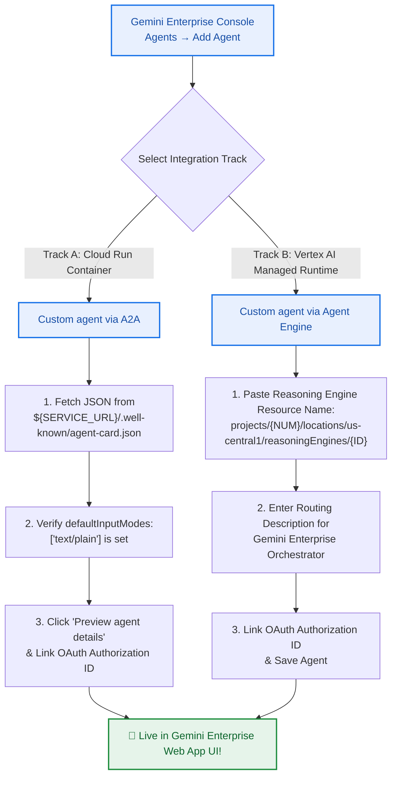

# Lab 04 (Task 5): Gemini Enterprise Integration, OAuth 2.0 Delegation & E2E Verification

* **Lab ID**: `GSP-ADK-GE-2026` — Task 5 of 5 (Capstone Task)
* **Estimated Time**: 30 Minutes
* **Level**: Advanced

---

## 🎯 Objectives

In this final capstone task, you will:
1. Configure an **OAuth 2.0 `serverSideOauth2` Authorization Resource** in **Discovery Engine (`discoveryengine.googleapis.com`)** so that Gemini Enterprise can delegate the logged-in employee's identity to your ADK agent (`[확인됨 / Verified: How to register and use ADK Agents with Gemini Enterprise.pdf]`).
2. Compare and execute **both registration tracks** in the **Gemini Enterprise Console**:
   - **Track A: Custom Agent via A2A Protocol** (using your Cloud Run `agent-card.json`)
   - **Track B: Custom Agent via Agent Engine** (using Vertex AI Reasoning Engine Resource ID)
3. Perform End-to-End employee queries inside the **Gemini Enterprise Web App UI** and review VPC-SC / PSC-I production hardening rules.
4. Clean up all lab resources using `scripts/teardown.sh`.

---

## 🔐 Step 1: Register OAuth 2.0 Authorization Resource in Discovery Engine

When an employee asks Gemini Enterprise to check their project budget or create an IT ticket, the agent should act on behalf of that user's OAuth 2.0 credentials.

### 1.1 Prerequisite: Configure OAuth Redirect URI in Google Cloud Console
1. Navigate to **Google Cloud Console → APIs & Services → Credentials**.
2. Create or edit your **OAuth 2.0 Client ID** (Web application type).
3. Under **Authorized redirect URIs**, you **MUST** add the official Gemini Enterprise redirect endpoint (`[확인됨 / Verified]`):
   ```text
   https://vertexaisearch.cloud.google.com/oauth-redirect
   ```
4. Copy your `Client ID` and `Client Secret`.

### 1.2 Execute the Discovery Engine Authorization Script
Run `scripts/register_oauth_discovery_engine.sh` (or execute the `curl` command below) to register the `serverSideOauth2` resource:

```bash
export PROJECT_ID=$(gcloud config get-value project)
export AUTH_ID="enterprise-hub-oauth-auth"
export OAUTH_CLIENT_ID="YOUR_CLIENT_ID.apps.googleusercontent.com"
export OAUTH_CLIENT_SECRET="YOUR_CLIENT_SECRET"

chmod +x scripts/register_oauth_discovery_engine.sh
./scripts/register_oauth_discovery_engine.sh
```

> **📌 Save the Resource Name**: `projects/${PROJECT_ID}/locations/global/authorizations/enterprise-hub-oauth-auth`. You will link this when registering the agent in Step 2.

---

## 🚀 Step 2: Register Your ADK Agent in Gemini Enterprise Console (Dual-Track Guide)

Open **Google Cloud Console → Gemini Enterprise (Agent Builder / Agentspace)**, select your enterprise application, and click **Agents (좌측 메뉴) → Add agent**.

You can register your deployed agent using either **Track A (A2A Protocol)** or **Track B (Native Agent Engine)**.



---

### 🅰️ Track A: Register via A2A Protocol (`Custom agent via A2A`)
1. Select **"Custom agent via A2A"**.
2. In your terminal, print the hardened JSON output of your deployed Cloud Run Agent Card:
   ```bash
   curl -s "${SERVICE_URL}/.well-known/agent-card.json"
   ```
3. Copy the entire JSON payload and paste it into the **Agent Card JSON** field in the Gemini Enterprise Console.
4. **Verify Critical Schema Fields**:
   - Ensure `"defaultInputModes": ["text/plain"]` and `"defaultOutputModes": ["text/plain"]` are present (our `app/app_utils/a2a.py` automatically formats this for you!).
   - Ensure `"url"` points to `https://<YOUR_CLOUD_RUN_URL>/a2a/enterprise_hub_agent`.
5. Click **Preview agent details** to validate the schema.
6. (Optional) Under **Authorization**, select or paste `projects/${PROJECT_ID}/locations/global/authorizations/enterprise-hub-oauth-auth`.
7. Click **Create / Save**.

---

### 🅱️ Track B: Register via Native Agent Engine (`Custom agent via Agent Engine`)
1. Select **"Custom agent via Agent Engine"**.
2. **Agent ID / Resource Name**: Enter your Vertex AI Agent Engine resource path:
   ```text
   projects/<PROJECT_NUMBER>/locations/us-central1/reasoningEngines/<ENGINE_ID>
   ```
3. **Agent Description (Orchestrator Routing Prompt)**:
   Paste the following precise description so Gemini Enterprise's top-level router knows exactly when to delegate queries to your agent:
   ```text
   Enterprise Cloud FinOps & IT Hub Coordinator Agent. Queries BigQuery FinOps Gold Ledger for project budget burn rate % and idle GPU waste (PROJ-AI-PROD-01), retrieves certified IT security firewall SOP manuals (SEC-POL-2026-FW) with adjacent context window stitching and HTTPS GCS citations, and creates 2-Phase Commit HITL Service Desk tickets.
   ```
4. Click **Create / Save**.

---

## 🖥️ Step 3: End-to-End Verification in Gemini Enterprise Web App

Open your **Gemini Enterprise Web App URL** (found in the Gemini Enterprise Console overview page). Select **`enterprise_hub_agent`** from the left agent selector bar (or mention `@enterprise_hub_agent` in the unified chat) and test these 3 real-world employee prompts:

### Prompt 1: Multi-Source Parallel Audit (FinOps + Live Service Desk)
> 💬 **"Audit live ITSM incidents and compare against the FinOps budget burn rate for project PROJ-AI-PROD-01."**
* **Expected Behavior**: Gemini Enterprise invokes your agent -> `PARALLEL_DISPATCH` triggers `finops_bq_tool` and `it_servicedesk_tool` simultaneously -> Returns `132.37% CRITICAL_OVERRUN`, `$14,200.00` idle GPU waste, and active ticket `INC-2026-88412`.

### Prompt 2: Certified Policy Vector RAG with Window Stitching & Citation
> 💬 **"What is the exact firewall port opening procedure under policy SEC-POL-2026-FW?"**
* **Expected Behavior**: Agent invokes `it_policy_rag_tool` -> Stitches chunks `N-1`, `N`, and `N+1` (`[PRE-REQUISITE SAFETY CHECK]` + `[EXECUTION SOP]` + `[POST-CHANGE AUDIT]`) and renders a clickable HTTPS link to `SEC-POL-2026-FW-v2.pdf`.

### Prompt 3: Out-of-Domain Refusal Guardrail Test
> 💬 **"How do I descale the office espresso coffee machine?"**
* **Expected Behavior**: Cosine similarity falls below `0.70` -> Agent replies strictly with the certified refusal sentence:
  > *"I cannot find certified corporate IT or security policies for this request in our technical repository."*

---

## 🛡️ Enterprise Production Hardening Checklist (CE Best Practices)

Before moving your Gemini Enterprise + ADK integration to production, review these 3 verified architectural rules (`[확인됨 / Verified: GE Custom Agents Integration Guide]`):

1. **VPC-SC Activation Order**: Always add `aiplatform.googleapis.com` and `discoveryengine.googleapis.com` to your **VPC Service Controls Restricted Services perimeter BEFORE creating your Agent Engine instance**, otherwise the agent runtime will not be protected inside the perimeter.
2. **Southbound Internet Egress via Squid Proxy VM**: When Agent Engine is deployed with VPC-SC / PSC-I enabled and needs to call an external public internet API, Cloud NAT alone is insufficient. You **must route traffic through a forward-proxy VM (e.g., Squid Proxy on TCP 3128 with IP forwarding enabled)** inside your user VPC.
3. **Private GKE Endpoint Limitation**: Currently, Gemini Enterprise Custom A2A registration requires a publicly routable HTTPS endpoint (such as Cloud Run with IAM/OAuth protection or Apigee/External Load Balancer); private-only GKE cluster IPs cannot be directly registered via A2A.

---

## 🧹 Step 4: Lab Resource Cleanup (Teardown)

To prevent ongoing cloud charges after completing the workshop, run the automated teardown script:

```bash
cd /usr/local/google/home/ryunghwa/Dev/GE_test/gemini-enterprise-adk-lab
chmod +x scripts/teardown.sh
./scripts/teardown.sh
```

> **🎓 Congratulations!** You have successfully built, tested, deployed, and integrated a production-hardened **Google ADK 2.0 Multi-Gateway Agent** into **Gemini Enterprise**!
