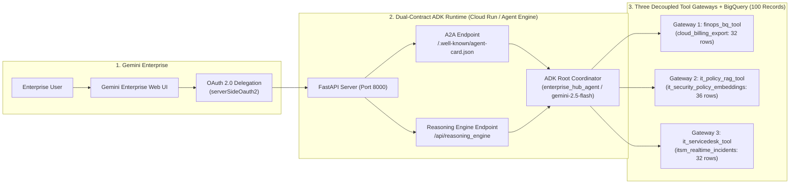

# Cymbal Enterprise AI Hub: Gemini Enterprise 기반 Google ADK 2.0 엔터프라이즈 에이전트 구축 및 연동

> **CE Qwiklabs Official Lab Guide** (`go/ceqwiklabs-lab-guide-template` 표준 양식 준수)
> * **소요 시간 (Duration)**: `2 hours` (120분)
> * **크레딧 (Credits)**: `1 Credit` (CE Qwiklabs Classroom / Labs for Sales 무상 제공)
> * **난이도 (Level)**: `Intermediate / Advanced` (중급 ~ 고급)
> * **참조 템플릿**: [`go/ceqwiklabs-lab-guide-template`](https://docs.google.com/document/d/1KyWEGliGq01sUCYAeJ71TQExE7IGjTqhuGO_NvHu8BU) | [`go/ceqwiklabs-lab-instructions`](https://docs.google.com/document/d/1epntgNQo7lcmJhm9a5VFazeVPXjrBprp6V1XvLBmdzw)
> * **영문 Qwiklabs 원본 (English Version)**: **[labs/QWIKLABS_LAB_GUIDE_EN.md](QWIKLABS_LAB_GUIDE_EN.md)**

---

## Overview

본 핸즈온 랩에서는 **Cymbal Enterprise의 클라우드 AI 아키텍트**가 되어, **Google Agent Development Kit (`google-adk` 2.0)** 기반의 엔터프라이즈 클라우드 FinOps 및 IT 통합 코디네이터 에이전트(`enterprise_hub_agent`)를 구축하고, 이를 **Gemini Enterprise (구 Google Agentspace)** 포털에 연동합니다.

단일 에이전트에 모든 정형 SQL과 비정형 규정 문서를 직접 연결할 때 발생하는 **컨텍스트 오염(Context Pollution)**과 **환각(Hallucination)**을 방지하기 위해, 데이터 모달리티별로 분리된 **3대 엔터프라이즈 도구 게이트웨이(Decoupled Tool Gateways)** 아키텍처를 구현합니다. 또한 단일 FastAPI 컨테이너에서 오픈 표준 **Agent2Agent (A2A) 프로토콜(`/.well-known/agent-card.json`)**과 **Vertex AI Reasoning Engine 계약(`/api/reasoning_engine`)**을 동시에 서빙하는 **Dual-Contract 런타임**을 구축하고, 총 **100건의 엔터프라이즈 실전 데이터셋**이 적재된 **BigQuery (`enterprise_finops_gold`)**를 기반으로 End-to-End 동작을 검증합니다.



---

## Objectives

본 실습에서는 다음 작업을 수행하는 방법을 학습합니다:

* 실습 환경 초기화 스크립트(`scripts/setup_environment.sh`)를 통해 BigQuery `enterprise_finops_gold` 데이터셋을 생성하고 **총 100건의 엔터프라이즈 실전 테스트 데이터(FinOps 정형 예산/지출 32건, 보안 SOP 정책 청크 36건, ITSM 실시간 장애 티켓 32건)**를 자동 적재(Seeding)합니다.
* **Google ADK (`google-adk`) 2.0** 기반의 루트 코디네이터 에이전트(`enterprise_hub_agent`)와 **3대 분리형 도구 게이트웨이(`finops_bq_tool`, `it_policy_rag_tool`, `it_servicedesk_tool`)** 및 자정 기준 캐시 무효화 콜백(`before_agent_callback`)을 구성하고 자동 검증 스위트(`validate_agent.py`)로 검증합니다.
* 단일 FastAPI 서버에서 **Agent2Agent (A2A)** 프로토콜과 **Vertex AI Reasoning Engine** 계약을 동시에 노출하는 **Dual-Contract 런타임**을 구동하고, 대화형 웹 스튜디오(`/studio`)에서 5대 실전 시나리오를 테스트합니다.
* ADK 에이전트 컨테이너를 **Google Cloud Run (Track A)** 및 **Vertex AI Agent Engine (Track B)**에 배포합니다.
* Discovery Engine API에 **OAuth 2.0 권한 위임 리소스(`serverSideOauth2`)**를 등록하고, **Gemini Enterprise 콘솔**에 커스텀 에이전트를 등록하여 End-to-End 통합 질의를 수행합니다.

---

## Setup and requirements

> **TCD Public Fragment Reference**: `[[import start_qwiklabs]]`

### Before you click the Start Lab button

실습을 시작하기 전에 다음 안내 사항을 주의 깊게 확인하세요. 실습에는 제한 시간(`2 hours`)이 설정되어 있으며 일시 중지할 수 없습니다. **Start Lab**을 클릭하면 타이머가 시작되며, 표시된 시간 동안 Google Cloud 리소스를 사용할 수 있습니다.

본 Qwiklabs 핸즈온 랩은 시뮬레이션이나 데모 환경이 아닌 **실제 Google Cloud 환경**에서 직접 실습을 수행할 수 있도록 임시 자격 증명(`student-xx-xxxxxxxx@qwiklabs.net`)을 발급합니다.

### What you need

본 실습을 완료하려면 다음 환경이 필요합니다:

* 표준 인터넷 브라우저 (Google Chrome 브라우저 권장)
* 시크릿 모드(Incognito window) 브라우저 창 (개인 Google 계정과의 자격 증명 충돌 방지)
* 실습을 완료하기 위한 충분한 시간 (약 90~120분)

> **Note**: 개인 Google Cloud 계정이나 기존 사내 프로젝트가 있더라도 이 실습에서는 사용하지 마세요. 과금이 발생하는 것을 방지하기 위해 반드시 Qwiklabs **Connection Details** 패널에 표시된 임시 계정과 프로젝트 ID를 사용해야 합니다.

### How to start your lab and sign in to the Google Cloud Console

1. 화면 좌측 상단의 **Start Lab** 버튼을 클릭합니다. 좌측에 이번 실습에서 사용할 임시 자격 증명이 포함된 **Connection Details** 패널이 나타납니다.
2. **Username**을 복사한 후 **Open Google Console** 버튼을 클릭합니다.
3. 계정 선택(**Choose an account**) 페이지가 나타나면 **Use another account**를 클릭합니다.
4. 복사한 **Username**과 **Password**를 차례대로 붙여넣고 로그인합니다.
5. 이후 나타나는 약관 동의 화면에서 **Accept**를 클릭합니다 (임시 계정이므로 복구 옵션이나 2단계 인증, 무료 평가판 신청은 등록하지 마세요).

### Activate Cloud Shell

> **TCD Public Fragment Reference**: `[[import activate_cloud_shell]]`

Google Cloud Shell은 개발 도구가 사전 로드된 가상 머신으로, 5GB의 영구 홈 디렉토리를 제공하며 Google Cloud에서 실행됩니다.

1. Google Cloud 콘솔 우측 상단 툴바에서 **Activate Cloud Shell** 아이콘(`>_`)을 클릭합니다.
2. **Continue**를 클릭하여 Cloud Shell 세션을 연결합니다. 프로비저닝 및 연결에 몇 초 정도 소요됩니다.
3. Cloud Shell 터미널이 열리면 다음 명령어를 실행하여 활성 계정 인증 상태를 확인합니다:

| Command |
| :--- |
| `gcloud auth list` |

브라우저에 권한 부여 팝업이 나타나면 **Authorize**를 클릭합니다.

| Output (do not copy) |
| :--- |
| `ACTIVE: *`<br>`ACCOUNT: student-01-xxxxxxxxxxxx@qwiklabs.net`<br>`To set the active account, run:`<br>`    $ gcloud config set account ACCOUNT` |

4. 다음 명령어를 실행하여 현재 활성화된 Qwiklabs 프로젝트 ID를 확인합니다:

| Command |
| :--- |
| `gcloud config list project` |

| Output (do not copy) |
| :--- |
| `[core]`<br>`project = qwiklabs-gcp-xx-xxxxxxxxxxxx` |

---

## Task 1. 실습 환경 부트스트랩 및 BigQuery 엔터프라이즈 데이터셋(100건) 자동 적재

본 태스크에서는 `Cymbal Enterprise AI Hub` 소스 코드 저장소를 Cloud Shell로 복제하고, Google Cloud SDK (`gcloud`) 및 Application Default Credentials (ADC) 인증을 확인한 뒤, 원클릭 부트스트랩 스크립트(`scripts/setup_environment.sh`)를 실행하여 **BigQuery `enterprise_finops_gold` 데이터셋과 3개 테이블(총 100건의 실전 데이터)**을 자동으로 생성하고 적재합니다.

### Sub-Task 1.1. Git 및 Google Cloud SDK / ADC 사전 점검

1. Cloud Shell (또는 실습용 Linux VM)에서 `git`과 `gcloud` CLI가 정상 설치되어 있는지 확인하고, Python SDK(`google-cloud-bigquery`, `google-genai`)가 사용할 Application Default Credentials (ADC) 및 프로젝트 환경변수를 설정합니다:

| Command |
| :--- |
| `git --version || (sudo apt-get update && sudo apt-get install -y git)`<br>`gcloud --version`<br>`export PROJECT_ID=$(gcloud config get-value project)`<br>`echo "Active Project ID: ${PROJECT_ID}"` |

| Output (do not copy) |
| :--- |
| `git version 2.39.5`<br>`Google Cloud SDK 512.0.0`<br>`Active Project ID: qwiklabs-gcp-xx-xxxxxxxxxxxx` |

> **Tip**: 만약 Cloud Shell이 아닌 로컬 PC나 신규 VM에서 실습 중이며 ADC 자격 증명이 없다면, `gcloud auth application-default login` 명령어를 추가로 1회 실행하여 브라우저 인증을 완료하세요. (`scripts/setup_environment.sh`의 `🔍 [Preflight]` 단계에서도 이를 자동으로 점검합니다.)

### Sub-Task 1.2. 실습 저장소 복제 및 `.env` 환경변수 구성

1. 다음 명령어를 실행하여 GitHub에서 `gemini-enterprise-adk-lab` 저장소를 복제하고 프로젝트 디렉토리로 이동합니다:

| Command |
| :--- |
| `git clone https://github.com/rhkim77/gemini-enterprise-adk-lab.git`<br>`cd gemini-enterprise-adk-lab` |

2. `.env.example` 템플릿을 `.env` 파일로 복사하고, 현재 Qwiklabs 프로젝트 ID를 `.env`에 자동으로 바인딩합니다:

| Command |
| :--- |
| `cp .env.example .env`<br>`sed -i "s/<YOUR_PROJECT_ID>/${PROJECT_ID}/g" .env`<br>`grep -E "GOOGLE_CLOUD_PROJECT|BQ_FINOPS_DATASET" .env` |

| Output (do not copy) |
| :--- |
| `GOOGLE_CLOUD_PROJECT="qwiklabs-gcp-xx-xxxxxxxxxxxx"`<br>`BQ_FINOPS_DATASET="enterprise_finops_gold"` |

### Sub-Task 1.3. 원클릭 부트스트랩 스크립트 실행 (`setup_environment.sh`)

1. 다음 명령어를 실행하여 필수 Google Cloud API 5종(`aiplatform`, `bigquery`, `run`, `discoveryengine`, `cloudresourcemanager`)을 활성화하고, Python 가상환경(`.venv`) 설치 및 **BigQuery 100건 실전 데이터셋 자동 적재(`scripts/seed_bigquery.py`)**를 수행합니다:

| Command |
| :--- |
| `chmod +x scripts/setup_environment.sh`<br>`./scripts/setup_environment.sh` |

**Output (do not copy)**

```text
============================================================================
🔍 [Preflight] Checking Google Cloud SDK (gcloud) & Authentication...
============================================================================
✅ Google Cloud SDK detected: Google Cloud SDK 5xx.0.0 (/usr/lib/google-cloud-sdk/bin/gcloud)
✅ jq detected: jq-1.7
🔧 Auto-configured .env with active GCP Project ID: qwiklabs-gcp-xx-xxxxxxxxxxxx
============================================================================
🚀 Starting One-Click Bootstrap for Project: qwiklabs-gcp-xx-xxxxxxxxxxxx (us-central1)
============================================================================
[Step 1/4] Enabling Google Cloud APIs (BigQuery, Vertex AI, Discovery Engine, Cloud Run)...
[Step 2/4] Verifying Python Virtual Environment (.venv)...
  📦 Installing dependencies into .venv (uv if available, otherwise python3 -m venv + pip)...
[Step 3/4] Creating BigQuery Datasets & Seeding 100 Enterprise JSON Records into BigQuery...
🎯 Target Google Cloud Project: `qwiklabs-gcp-xx-xxxxxxxxxxxx` | Dataset: `enterprise_finops_gold`
  ✅ [Gateway 1] Seeded 32 rows into BigQuery table `qwiklabs-gcp-xx-xxxxxxxxxxxx.enterprise_finops_gold.cloud_billing_export`
  ✅ [Gateway 2] Seeded 36 rows into BigQuery table `qwiklabs-gcp-xx-xxxxxxxxxxxx.enterprise_finops_gold.it_security_policy_embeddings`
  ✅ [Gateway 3] Seeded 32 rows into BigQuery table `qwiklabs-gcp-xx-xxxxxxxxxxxx.enterprise_finops_gold.itsm_realtime_incidents`

📊 [BigQuery Live Table Verification Summary]
  • 1_cloud_billing_export              : 32 rows in BigQuery
  • 2_it_security_policy_embeddings     : 36 rows in BigQuery
  • 3_itsm_realtime_incidents           : 32 rows in BigQuery
  🎉 Total BigQuery Records Verified: 100 / 100 rows (100% Match)

[Step 4/4] Running Automated Verification Suite (validate_agent.py)...
📊 VALIDATION SUMMARY: 10 PASSED, 0 FAILED (TOTAL: 10 TESTS | 100 DATA RECORDS)
============================================================================
✅ Environment Bootstrap, BigQuery 100-Record Seeding & Verification Complete!
============================================================================
```

> **판독 포인트**: 이 단계에서 반드시 확인해야 할 두 줄은
> `🎉 Total BigQuery Records Verified: 100 / 100 rows (100% Match)`와
> `📊 VALIDATION SUMMARY: 10 PASSED, 0 FAILED`입니다.
> 데이터 적재 건수가 100건 미만이거나 `FAILED`가 1건이라도 있으면 Task 2 이후가 모두 실패하므로,
> 여기서 멈추고 `labs/TROUBLESHOOTING.md`를 먼저 확인하세요.
> (`⚠️` 경고 줄은 `jq` 미설치 등 비치명적 항목이므로 진행에 지장이 없습니다.)


### Sub-Task 1.4. BigQuery 적재 데이터(100건) 직접 조회 검증

1. `bq query` 명령어를 실행하여 BigQuery `enterprise_finops_gold` 데이터셋 내 3개 테이블에 총 100건의 레코드가 정상적으로 적재되었는지 확인합니다:

| Command |
| :--- |
| `bq query --use_legacy_sql=false "SELECT 'cloud_billing_export' AS table_name, COUNT(*) AS row_count FROM \`${PROJECT_ID}.enterprise_finops_gold.cloud_billing_export\` UNION ALL SELECT 'it_security_policy_embeddings', COUNT(*) FROM \`${PROJECT_ID}.enterprise_finops_gold.it_security_policy_embeddings\` UNION ALL SELECT 'itsm_realtime_incidents', COUNT(*) FROM \`${PROJECT_ID}.enterprise_finops_gold.itsm_realtime_incidents\`"` |

| Output (do not copy) |
| :--- |
| `+-------------------------------+-----------+`<br>`|          table_name           | row_count |`<br>`+-------------------------------+-----------+`<br>`| cloud_billing_export          |        32 |`<br>`| it_security_policy_embeddings |        36 |`<br>`| itsm_realtime_incidents       |        32 |`<br>`+-------------------------------+-----------+` |

> ✅ **Check my progress**
> **Click Check my progress to verify the objective.**
> *(Qwiklabs Assessment 1 / 50점: BigQuery `enterprise_finops_gold` 데이터셋의 3개 테이블에 총 100건이 적재되었는지 확인)*

---

## Task 2. Google ADK 2.0 코디네이터 에이전트 및 3대 도구 게이트웨이 검증

본 태스크에서는 `Cymbal Enterprise AI Hub`의 핵심인 **3대 분리형 도구 게이트웨이(`app/tools/`)**와 **루트 코디네이터 에이전트(`app/agent.py`)**의 아키텍처 및 가드레일 설계를 확인하고, 10개 항목 자동 검증 스위트(`scripts/validate_agent.py`)를 실행하여 모든 게이트웨이가 정상 동작하는지 확인합니다.

### Sub-Task 2.1. 3대 분리형 도구 게이트웨이 구조 확인

1. 다음 명령어를 실행하여 3대 도구 게이트웨이의 툴 함수 시그니처 위치를 한 번에 확인합니다:

| Command |
| :--- |
| `grep -n "^def .*_tool" app/tools/*.py` |

| Output (do not copy) |
| :--- |
| `app/tools/finops_bq_tool.py:77:def finops_bq_tool(query_or_project_id: str) -> dict:`<br>`app/tools/it_policy_rag_tool.py:154:def it_policy_rag_tool(query: str) -> str:`<br>`app/tools/it_servicedesk_tool.py:106:def it_servicedesk_tool(` |

2. Gateway 1의 시그니처와 **docstring**을 자세히 확인합니다. Google ADK는 이 **docstring 전문을 Gemini Function Calling 스키마의 `description` 필드로 그대로 전달**하므로, 툴의 docstring은 단순 주석이 아니라 **모델이 읽는 유일한 API 명세**입니다:

| Command |
| :--- |
| `grep -n -A 12 "^def finops_bq_tool" app/tools/finops_bq_tool.py` |

**Output (do not copy)**

```text
77:def finops_bq_tool(query_or_project_id: str) -> dict:
78-    """Queries BigQuery FinOps Gold Ledger (`enterprise_finops_gold.cloud_billing_export`, 32 Projects).
79-
80-    Always enforces Knowledge Catalog Business Glossary formulas to eliminate NL2SQL hallucination.
81-
82-    Args:
83-        query_or_project_id: Target GCP Project ID (e.g., 'PROJ-AI-PROD-01' .. 'PROJ-OPS-MON-32'),
84-            department name (e.g., 'AI Research', 'FinTech Security'), or alert status ('CRITICAL_OVERRUN').
85-
86-    Returns:
87-        dict: Standardized FinOps metrics, burn rate percentage, alert status, dataset count, and executed GoogleSQL.
88-    """
```

3. 각 게이트웨이의 역할은 다음과 같습니다:

* **Gateway 1 (`finops_bq_tool.py`)**: BigQuery `cloud_billing_export` 테이블(32건)을 실시간 SQL로 조회하며, LLM이 임의로 공식을 추측하지 못하도록 **Knowledge Catalog 표준 공식(`예산 소진율 % = 당월 지출액 / 월 예산 * 100`)**과 **Plotly 시각화 페이로드**를 함께 반환합니다.
* **Gateway 2 (`it_policy_rag_tool.py`)**: BigQuery `it_security_policy_embeddings` 테이블(36건)에 대해 코사인 유사도(`>= 0.70`) 검색을 수행하고, 히트된 청크의 **앞뒤 인접 청크(`N-1 ~ N+1`)를 자동 결합(Adjacent Window Stitching)**하여 사전 안전 수칙 누락을 방지합니다. 유사도 `0.70` 미만 도메인 외 질의(예: 에스프레소 머신 수리)는 **인증된 거절 문구(Certified Refusal)**로 즉시 차단합니다.
* **Gateway 3 (`it_servicedesk_tool.py`)**: BigQuery `itsm_realtime_incidents` 테이블(32건)을 조회하고, 인프라 변경(방화벽 포트 개방, GPU 쿼터 증설) 시 **OAuth 2.0 사용자 신원 감사**와 **2-Phase Commit (2PC) 멱등성 락(`lock:user:{id}:mutation`)** 및 **`PENDING_HITL_APPROVAL` 상태**를 강제합니다.

### Sub-Task 2.2. 루트 코디네이터 에이전트(`app/agent.py`) 및 캐시 무효화 콜백 확인

1. `app/agent.py`에 정의된 루트 에이전트(`enterprise_hub_agent`)와 자정(Midnight) 경계 캐시 무효화 콜백(`before_agent_callback`)을 확인합니다:

| Command |
| :--- |
| `grep -n -A 6 "^root_agent = Agent(" app/agent.py` |

**Output (do not copy)**

```text
122:root_agent = Agent(
123-    name="enterprise_hub_agent",
124-    model=Gemini(model=MODEL, retry_options=retry_cfg),
125-    instruction=SYSTEM_INSTRUCTION,
126-    tools=[finops_bq_tool, it_policy_rag_tool, it_servicedesk_tool],
127-    before_agent_callback=validate_and_update_temporal_cache,
128-)
```

> **판독 포인트**: `before_agent_callback`에 바인딩된 함수의 첫 번째 파라미터 이름은 반드시 `callback_context`여야 합니다.
> ADK 2.x 런타임이 `callback(callback_context=...)` 형태로 **키워드 호출**하기 때문이며, 이름이 다르면 `TypeError`가 발생하고
> 에이전트가 조용히 결정론적 라우터로 강등됩니다.

### Sub-Task 2.3. 자동 검증 스위트(`scripts/validate_agent.py`) 실행

1. 다음 명령어를 실행하여 100건의 데이터셋, BigQuery 실시간 연동, 3대 게이트웨이 가드레일, Dual-Contract 라우트, 그리고 문서 드리프트 검사까지 포함된 **10개 항목 자동 검증 스위트**를 실행합니다:

| Command |
| :--- |
| `.venv/bin/python3 scripts/validate_agent.py` |

**Output (do not copy)**

```text
====================================================================================
🧪 CYMBAL ENTERPRISE AI HUB - AUTOMATED VALIDATION SUITE (100-RECORD DATASET)
Project ID: qwiklabs-gcp-xx-xxxxxxxxxxxx | ITSM Mode: MOCK
====================================================================================

[TEST 1/10] Dataset Scale Audit (>= 30 Records per Gateway)...
  • Gateway 1 (FinOps Projects):      32 records (Target >= 30)
  • Gateway 2 (Policy RAG Chunks):    36 chunks across 12 policies (Target >= 30)
  • Gateway 3 (ITSM Incidents):       32 records (Target >= 30)
  • Total Enterprise Dataset Records: 100 records
  [PASS] All 3 gateways meet the 30+ realistic enterprise record threshold.

[TEST 2/10] Gateway 1: FinOps Analytics (Project & Department Queries across 32 Projects)...
  [PASS] Completed in 2.97s — Multi-project & department SQL aggregations verified.

[TEST 3/10] Gateway 2: IT Policy RAG Window Stitching (Bilingual KR/EN & Cosine Sim >= 0.70)...
  [PASS] Completed in 2.78s — Adjacent chunks N-1~N+1 stitched & Bilingual Cosine Similarity verified.

[TEST 4/10] Gateway 2: Expanded Policy Corpus Query (NET-POL-2026-PSCI & DLP Policy)...
  [PASS] Completed in 2.78s — Expanded policies retrieved with 3-chunk window stitching.

[TEST 5/10] Gateway 2: Out-of-Domain Refusal Gate (Espresso Machine & Personal Cloud Photos)...
  [PASS] Completed in 0.00s — Certified refusal guardrail enforced strictly (EN & KR).

[TEST 6/10] Gateway 3: Expanded ITSM Incident Lookup (INC-2026-88415 & P1_CRITICAL Filter)...
  [PASS] Completed in 2.68s — Specific ticket lookup & P1 Critical filter (9 P1 incidents) verified.

[TEST 7/10] Gateway 3: Dual-Mode 2PC HITL Ticket Creation & OAuth 2.0 Delegation Audit...
  [PASS] Completed in 0.00s — 2PC lock, HITL flag & OAuth 2.0 identity (architect@cymbal.enterprise) verified.

[TEST 8/10] Coordinator Governance, ADK Callback Contract & A2A Agent Card Schema...
  [PASS] Completed in 0.00s — ADK callback contract `callback(callback_context=...)` honored, cache purged & A2A Card schema verified.

[TEST 9/10] Documentation Drift: Dependency Pin Consistency (requirements.txt <-> labs/03)...
  [PASS] Completed in 0.00s — Dependency pins consistent across requirements.txt and labs/03.

[TEST 10/10] Lab Structure Integrity: Completion Checkpoints & Troubleshooting Links...
  [PASS] Completed in 0.00s — All 5 labs expose a checkpoint & troubleshooting link.

====================================================================================
📊 VALIDATION SUMMARY: 10 PASSED, 0 FAILED (TOTAL: 10 TESTS | 100 DATA RECORDS)
====================================================================================
🎉 All 100 enterprise dataset records, 3 gateways, OAuth delegation & ADK 2.0 runner verified!
```

> **Note**: 스위트 시작 전 `Out-of-domain query blocked by refusal guardrail ...` 경고 2줄이 먼저 출력될 수 있습니다.
> 이는 TEST 5의 거절 가드레일이 정상 동작한다는 로그이며 오류가 아닙니다.

> 🔎 **자가 검증 (Self-check)**
> 이 단계는 소스 코드를 읽고 이해하는 단계라 클라우드에 흔적이 남지 않으므로 Qwiklabs 채점 대상이 아닙니다.
> 대신 `.venv/bin/python3 scripts/validate_agent.py`가 **10 PASSED, 0 FAILED**를 출력하는지 확인하세요.

---

## Task 3. Dual-Contract 서빙 런타임 구동 및 대화형 웹 스튜디오 5대 시나리오 검증

본 태스크에서는 단일 FastAPI 서버(`app/fast_api_app.py`)를 백그라운드에서 구동하여 **Agent2Agent (A2A) 디스커버리 엔드포인트(`/.well-known/agent-card.json`)**와 **Reasoning Engine 엔드포인트(`/api/reasoning_engine`)**가 정상적으로 노출되는지 검증하고, Cloud Shell 웹 미리보기(`Port 8000`)를 통해 **Cymbal Enterprise AI Hub 대화형 웹 스튜디오(`/studio`)**를 테스트합니다.

### Sub-Task 3.1. Dual-Contract FastAPI 서버 구동 및 딥 헬스체크 확인

1. FastAPI 서버를 포트 `8000`에서 백그라운드로 실행하고, `/healthz?deep=true` 엔드포인트를 호출하여 모든 서브시스템 상태를 검증합니다:

| Command |
| :--- |
| `nohup .venv/bin/uvicorn app.fast_api_app:app --host 0.0.0.0 --port 8000 > /tmp/hub_server.log 2>&1 &`<br>`sleep 3`<br>`curl -s "http://localhost:8000/healthz?deep=true" | python3 -m json.tool` |

**Output (do not copy)**

```json
{
    "status": "healthy",
    "agent": "enterprise_hub_agent",
    "model": "gemini-2.5-flash",
    "adk_runner_constructed": true,
    "contracts": [
        "A2A",
        "ReasoningEngine"
    ],
    "execution_engine": "ADK_2.0_RUNNER (gemini-2.5-flash)",
    "probe_latency_ms": 2376,
    "adk_runner_active": true
}
```

> **판독 포인트**: `execution_engine`이 `ADK_2.0_RUNNER`이면 실제 ADK 경로로 응답한 것입니다.
> 만약 `DETERMINISTIC_HYBRID_ROUTER`로 표시되면 ADK 호출이 실패하고 결정론적 라우터로 강등된 상태이며,
> 이때는 `status`가 `degraded`로 바뀌고 `last_adk_error`와 `remediation` 필드가 함께 반환됩니다.
> `probe_latency_ms`는 실제 Gemini 호출을 포함하므로 환경에 따라 1,500~4,000ms 범위에서 달라집니다.

### Sub-Task 3.2. A2A Agent Card (`/.well-known/agent-card.json`) 스키마 검증

1. Gemini Enterprise가 커스텀 에이전트를 탐색할 때 호출하는 `/.well-known/agent-card.json` 엔드포인트를 조회하여, 필수 필드(`defaultInputModes: ["text/plain"]`, `defaultOutputModes: ["text/plain"]`, `skills`)가 포함되어 있는지 확인합니다:

| Command |
| :--- |
| `curl -s "http://localhost:8000/.well-known/agent-card.json" | python3 -m json.tool` |

**Output (do not copy)**

```json
{
    "name": "enterprise_hub_agent",
    "description": "Enterprise Cloud FinOps & IT Hub Coordinator Agent. Orchestrates BigQuery FinOps burn rate analytics, IT Security SOP Vector RAG with window stitching (SEC-POL-2026-FW), and 2PC HITL Service Desk ticket creation with OAuth 2.0 identity delegation.",
    "url": "http://localhost:8000/a2a/enterprise_hub_agent",
    "version": "2.0.0",
    "capabilities": {
        "streaming": false,
        "pushNotifications": false,
        "stateTransitionHistory": true
    },
    "defaultInputModes": [
        "text/plain"
    ],
    "defaultOutputModes": [
        "text/plain"
    ]
}
```

### Sub-Task 3.3. 대화형 웹 스튜디오(`/studio`)에서 5대 엔터프라이즈 시나리오 실습

1. Cloud Shell 우측 상단의 **Web Preview (웹 미리보기)** 아이콘을 클릭한 후 **Preview on port 8000 (포트 8000에서 미리보기)**을 선택합니다.
2. 브라우저 탭이 열리면 URL 끝에 `/studio`를 붙여 **`https://<CLOUD_SHELL_PROXY_URL>/studio`** 화면으로 이동합니다.
3. 좌측 사이드바의 **5대 원클릭 시나리오 프리셋 버튼**을 차례대로 클릭하여 에이전트의 응답과 우측 **실시간 아키텍처 & 텔레메트리 트레이스 패널**을 확인합니다:
   * **시나리오 1 (FinOps 예산/소진율 조회)**: 프리셋 질의는 `PROJ-AI-PROD-01`(부서: `AI Research`)을 조회하며, 예산 소진율 `132.37%`(`CRITICAL_OVERRUN`)와 유휴 GPU 낭비액 `$14,200.00`, 표준 공식 문자열, 그리고 인터랙티브 Plotly 차트가 함께 렌더링되는지 확인합니다.
   * **시나리오 2 (보안 규정 Vector RAG & 윈도우 스티칭)**: 방화벽 포트(`8443`) 오픈 규정 질의 시 `SEC-POL-2026-FW` 문서의 인접 청크(`chunk_index` `1`, `2`, `3`)가 결합되어 사전 보안 감사 수칙과 Citation이 함께 출력되는지 확인
   * **시나리오 3 (OAuth 2.0 2PC 티켓 발행)**: 방화벽 오픈 티켓 생성 요청 시 로그인 사용자 이메일 감사 기록, `lock:user:{id}:mutation` 멱등성 키, `PENDING_HITL_APPROVAL` 상태 반환 확인
   * **시나리오 4 (복합 병렬 감사 질의)**: 예산 초과 부서 조회 + GPU 쿼터 동결 규정 검색 + 장애 티켓 조회가 단일 턴에서 병렬 호출되는지 확인
   * **시나리오 5 (도메인 외 질의 Certified Refusal)**: *"사무실 에스프레소 커피머신 석회 제거 청소 방법 알려줘"* 질문 시 코사인 유사도 미달(`< 0.70`)로 추측 없이 공인된 거절 문장만 단독 반환되는지 확인

> 🔎 **자가 검증 (Self-check)**
> 로컬에서 실행 중인 `uvicorn` 프로세스는 클라우드 API로 관찰할 수 없어 Qwiklabs 채점 대상이 아닙니다.
> 대신 `/healthz?deep=true` 응답의 `execution_engine`이 `ADK_2.0_RUNNER (gemini-2.5-flash)`인지 직접 확인하세요.

---

## Task 4. Google Cloud Run (Track A) 및 Vertex AI Agent Engine (Track B) 클라우드 배포

본 태스크에서는 로컬/Cloud Shell에서 검증을 마친 `Cymbal Enterprise AI Hub` 컨테이너를 **Google Cloud Run**에 서버리스 HTTPS 서비스로 배포하여 외부에서 접근 가능한 공인 **A2A Agent Card URL**을 확보합니다.

### Sub-Task 4.1. Google Cloud Run에 에이전트 컨테이너 빌드 및 배포 (Track A)

1. 다음 배포 스크립트(`scripts/deploy_cloud_run.sh`)를 실행하여 Cloud Build로 컨테이너 이미지를 빌드하고 Cloud Run 서비스(`enterprise-hub-agent`)로 배포합니다 (약 3~4분 소요):

| Command |
| :--- |
| `chmod +x scripts/deploy_cloud_run.sh`<br>`./scripts/deploy_cloud_run.sh` |

**Output (do not copy)**

```text
======================================================================
 [Cymbal Enterprise AI Hub] Cloud Run deployment
======================================================================
  -> Project ID : qwiklabs-gcp-xx-xxxxxxxxxxxx
  -> Region     : us-central1
  -> Service    : enterprise-hub-agent
  -> Image      : gcr.io/qwiklabs-gcp-xx-xxxxxxxxxxxx/enterprise-hub-agent:latest
======================================================================
[1/4] Building the container image with Cloud Build (this takes 3-4 minutes)...
ID        CREATE_TIME   DURATION  SOURCE   IMAGES   STATUS
xxxxxxxx  2026-...      3M21S     gs://... gcr.io.. SUCCESS
[2/4] Deploying to Cloud Run...
Service [enterprise-hub-agent] revision [enterprise-hub-agent-00001-abc] has been deployed and is serving 100 percent of traffic.
[3/4] Updating APP_URL so the Agent Card advertises its public address...
[4/4] Running the deep health probe against the deployed revision...
======================================================================
Service URL: https://enterprise-hub-agent-xxxxxxxxxx-uc.a.run.app
Health     : healthy
Engine     : ADK_2.0_RUNNER (gemini-2.5-flash)
======================================================================
✅ Deployment verified — the deployed revision is serving through the real ADK runner.
   Agent Card: https://enterprise-hub-agent-xxxxxxxxxx-uc.a.run.app/.well-known/agent-card.json

   Export this for Task 5:
     export SERVICE_URL="https://enterprise-hub-agent-xxxxxxxxxx-uc.a.run.app"
```


> **판독 포인트**: 마지막 `Engine` 줄이 이 단계의 유일한 합격 판정 기준입니다.
> `ADK_2.0_RUNNER (gemini-2.5-flash)`가 아니라 `DETERMINISTIC_HYBRID_ROUTER`가 출력되면
> 컨테이너는 기동했지만 ADK가 실행되지 않는 **성능 저하(degraded)** 상태입니다.
> 이 경우 스크립트가 복구용 `gcloud run services update` 명령을 그대로 출력하므로
> 해당 명령을 실행한 뒤 `labs/TROUBLESHOOTING.md` 1번 항목을 참고하세요.


### Sub-Task 4.2. 배포된 Cloud Run 서비스의 외부 HTTPS A2A 엔드포인트 확인

1. 배포된 Cloud Run 서비스 URL을 환경변수 `SERVICE_URL`에 저장하고, 외부 HTTPS 엔드포인트의 `/.well-known/agent-card.json`이 Cloud Run 공인 URL을 가리키는지 확인합니다:

| Command |
| :--- |
| `export SERVICE_URL=$(gcloud run services describe enterprise-hub-agent --region us-central1 --format="value(status.url)")`<br>`echo "Deployed Cloud Run URL: ${SERVICE_URL}"`<br>`curl -s "${SERVICE_URL}/.well-known/agent-card.json" | python3 -m json.tool` |

**Output (do not copy)**

```text
Deployed Cloud Run URL: https://enterprise-hub-agent-xxxxxxxxxx-uc.a.run.app
```
```json
{
    "name": "enterprise_hub_agent",
    "url": "https://enterprise-hub-agent-xxxxxxxxxx-uc.a.run.app/a2a/enterprise_hub_agent",
    "version": "2.0.0",
    "defaultInputModes": [
        "text/plain"
    ],
    "defaultOutputModes": [
        "text/plain"
    ]
}
```

> **Optional (Track B — Vertex AI Agent Engine 배포)**: 완전 관리형 Reasoning Engine 런타임에 배포하려면 `.venv/bin/python3 scripts/deploy_agent_engine.py`를 실행합니다 (먼저 `--dry-run`으로 설정을 미리 확인할 수 있습니다). 실행이 끝나면 `projects/{PROJECT_NUMBER}/locations/us-central1/reasoningEngines/{ENGINE_ID}` 형식의 리소스 이름이 출력되며, 이 값을 **Custom agent via Agent Engine** 등록 폼에 입력합니다. 실습 종료 후에는 `--delete <resource_name>`으로 반드시 삭제하세요 (관리형 런타임은 유휴 상태에서도 과금됩니다).

> ✅ **Check my progress**
> **Click Check my progress to verify the objective.**
> *(Qwiklabs Assessment 2 / 50점: Cloud Run 서비스 `enterprise-hub-agent`가 `Ready=True`이고 `GOOGLE_GENAI_USE_VERTEXAI=TRUE`가 설정되었는지 확인)*

---

## Task 5. Gemini Enterprise OAuth 2.0 권한 위임 설정 및 커스텀 에이전트 연동

본 태스크에서는 Gemini Enterprise 웹 포털에 로그인한 임직원의 신원(OAuth 2.0 Access Token)을 에이전트로 안전하게 위임하기 위해 Discovery Engine API에 **`serverSideOauth2` 권한 리소스**를 등록하고, Gemini Enterprise 콘솔에서 커스텀 에이전트를 연결하여 전체 실습 완료 상태를 검증합니다.

### Sub-Task 5.1. Discovery Engine OAuth 2.0 권한 위임 리소스(`authorizations`) 구성

1. Gemini Enterprise가 에이전트를 호출할 때 사용할 OAuth 2.0 Redirect URI는 반드시 **`https://vertexaisearch.cloud.google.com/oauth-redirect`**로 설정되어야 합니다. 다음 명령어를 실행하여 OAuth 권한 리소스 등록 스크립트 및 Lab 04 완료 검증 도구(`scripts/verify_lab04_completion.py`)를 실행합니다:

| Command |
| :--- |
| `.venv/bin/python3 scripts/verify_lab04_completion.py` |

**Output (do not copy)**

```text
====================================================================================
 [Lab 04 Completion Check] Gemini Enterprise & OAuth 2.0 Readiness
 Target: https://enterprise-hub-agent-xxxxxxxxxx-uc.a.run.app
====================================================================================
[PASS] 1. A2A Agent Card Schema Compliance (defaultInputModes/defaultOutputModes/skills)
       -> 3 skills, text/plain I/O, public HTTPS RPC url
[PASS] 2. OAuth 2.0 Redirect URI Specification
       -> https://vertexaisearch.cloud.google.com/oauth-redirect
[PASS] 3. Dual-Contract Endpoints (/a2a/enterprise_hub_agent & /api/reasoning_engine)
       -> /a2a/enterprise_hub_agent & /api/reasoning_engine
[PASS] 4. End-to-End OAuth Token Forwarding & 2PC HITL Audit
       -> oauth2_delegated=true, PENDING_HITL_APPROVAL enforced for lab-verifier@cymbal.enterprise
====================================================================================
🎉 Lab 04 Verification PASSED! Ready for the Gemini Enterprise portal.
```


> **참고**: 이 스크립트는 `SERVICE_URL` 환경변수가 설정되어 있으면 해당 Cloud Run 주소를,
> 없으면 `http://localhost:8000`을 검사합니다. Task 4.2에서 `export SERVICE_URL=...`을
> 수행했다면 위와 같이 배포된 서비스를 대상으로 검증됩니다.
> 4개 항목이 모두 `[PASS]`여야 Gemini Enterprise 콘솔 등록으로 진행할 수 있습니다.


### Sub-Task 5.2. Gemini Enterprise 콘솔에서 Custom Agent 등록 (Track A & Track B)

1. Google Cloud 콘솔 상단 검색창에서 **Gemini Enterprise** (또는 **AI Applications / Agentspace**)로 이동한 후 대상 엔터프라이즈 앱을 선택합니다.
2. 좌측 메뉴에서 **Agents (에이전트)** ➔ **+ Add agent (에이전트 추가)** ➔ **Custom agent**를 클릭합니다.
3. 배포 방식에 따라 아래 두 트랙 중 하나를 선택하여 등록합니다:
   * **Track A (`Custom agent via A2A`)**:
     * **Agent Name**: `Cymbal Enterprise AI Hub`
     * **Agent Card JSON**: Task 4.2에서 확인한 `${SERVICE_URL}/.well-known/agent-card.json` 응답 JSON을 붙여넣습니다.
     * **Authorization**: `cymbal-hub-oauth-auth` (`serverSideOauth2` 리소스)를 연결하고 **Save / Publish**를 클릭합니다.
   * **Track B (`Custom agent via Agent Engine`)**:
     * **Reasoning Engine Resource Name**: `projects/${PROJECT_ID}/locations/us-central1/reasoningEngines/${ENGINE_ID}`를 입력하고 **Save / Publish**를 클릭합니다.
4. Gemini Enterprise 웹 앱 프리뷰 링크를 열고 `@Cymbal Enterprise AI Hub`를 호출하여 정형 FinOps 예산 분석, 보안 규정 RAG 검색, 2PC 서비스 데스크 티켓 발행이 단일 대화창에서 수행되는지 확인합니다.

> 🔎 **자가 검증 (Self-check)**
> Gemini Enterprise 콘솔 등록은 채점 스크립트가 조회할 수 없고, Discovery Engine `authorizations` API는
> 현재 ALPHA 제한이 있어 Qwiklabs 채점 대상이 아닙니다.
> 대신 `.venv/bin/python3 scripts/verify_lab04_completion.py`가 **4개 항목 모두 `[PASS]`**인지 확인하세요.

---

## Congratulations!

축하합니다! 여러분은 **Google ADK (`google-adk`) 2.0**과 **BigQuery (`enterprise_finops_gold`, 100건 실전 데이터셋)**를 활용하여 **Cymbal Enterprise AI Hub** 코디네이터 에이전트를 구축하고, **3대 분리형 도구 게이트웨이**, **Dual-Contract 서빙 런타임(A2A + Reasoning Engine)**, **Cloud Run 배포**, 그리고 **Gemini Enterprise OAuth 2.0 연동**까지 전 과정을 성공적으로 완수했습니다.

### What we've covered

* **BigQuery 기반 100건 실전 데이터셋 자동 시딩 (`scripts/seed_bigquery.py`)**: 정형 FinOps 예산/지출 원장(32건), 비정형 보안 규정 임베딩 청크(36건), 실시간 ITSM 장애 티켓(32건) 적재 및 검증
* **3대 분리형 도구 게이트웨이 (Decoupled Tool Gateways)**:
  * `finops_bq_tool`: 표준 공식을 통한 NL2SQL 환각 방지 및 Plotly 차트 생성
  * `it_policy_rag_tool`: 코사인 유사도(`>= 0.70`) 품질 게이트, 인접 청크 윈도우 스티칭(`N-1 ~ N+1`), 도메인 외 질의 Certified Refusal
  * `it_servicedesk_tool`: OAuth 2.0 사용자 신원 감사 및 2-Phase Commit (`PENDING_HITL_APPROVAL`) 인프라 변경 통제
* **Dual-Contract 아키텍처**: 단일 FastAPI 컨테이너에서 A2A 표준 프로토콜과 Reasoning Engine 계약을 동시에 제공하여 Cloud Run과 Vertex AI Agent Engine 어디에나 즉시 배포 가능

### Clean up / End your lab

실습이 완료되었으면 좌측 상단의 **End Lab** 버튼을 클릭하여 Qwiklabs 세션을 종료합니다. (개인 Google Cloud 프로젝트에서 실습한 경우 `./scripts/teardown.sh`를 실행하여 BigQuery 데이터셋과 Cloud Run 서비스를 안전하게 정리할 수 있습니다.)

---

## Appendix: CE Qwiklabs 번들 구성 및 채점 기준

본 랩을 `ce.qwiklabs.com`에 패키징할 때 사용하는 **Lab Bundle Spec v2 번들**은
저장소의 `qwiklabs_bundle/labs/gemini-enterprise-adk-lab/`에 있습니다.
(구성 근거와 제출 절차는 [`qwiklabs_bundle/README.md`](../qwiklabs_bundle/README.md) 참고)

Activity Tracking 채점 스크립트는 **클라우드에 남은 상태만 조회할 수 있습니다.**
따라서 5개 태스크 중 클라우드 아티팩트를 남기는 2개만 채점 대상이며, 나머지 3개는
채점 대신 **자가 검증 스크립트**로 합격 여부를 확인합니다.

| Task | 클라우드 아티팩트 | 채점 | 검증 방법 |
| :--- | :--- | :---: | :--- |
| **Task 1** (BigQuery 100건 적재) | 데이터셋 + 3개 테이블 | ✅ **50점** | `check_bigquery_seed.rb` — `BigqueryV2`로 3개 테이블의 `num_rows` 조회 (32/36/32) |
| **Task 2** (ADK 도구 이해) | 없음 (소스 코드 읽기) | ❌ | `scripts/validate_agent.py` → 10 PASSED, 0 FAILED |
| **Task 3** (Dual-Contract 런타임) | 없음 (로컬 `uvicorn` 프로세스) | ❌ | `/healthz?deep=true` → `execution_engine: ADK_2.0_RUNNER` |
| **Task 4** (Cloud Run 배포) | Cloud Run 서비스 | ✅ **50점** | `check_cloud_run_service.rb` — `Ready=True` **및** `GOOGLE_GENAI_USE_VERTEXAI=TRUE` 확인 |
| **Task 5** (Gemini Enterprise 연동) | 콘솔 측 등록 / ALPHA 제한 API | ❌ | `scripts/verify_lab04_completion.py` → 4개 항목 `[PASS]` |

> **왜 Task 4 채점이 `Ready=True`만 보지 않는가**: `GOOGLE_GENAI_USE_VERTEXAI=TRUE`가
> 빠진 서비스도 정상 기동하고 Agent Card까지 응답합니다. 다만 내부적으로 ADK 대신
> 결정론적 폴백 라우터로 **조용히 성능 저하(degraded)**됩니다. `Ready`만 검사하면
> 실제로는 ADK를 실행하지 않는 배포가 만점을 받게 되므로, 환경변수까지 함께 검사하고
> 누락 시 부분 점수(25점)를 부여합니다.

> **미확정 항목**: Cloud Run 서비스 핸들명(`primary_project.RunV1`)과 Gemini Enterprise용
> Provisioned Throughput(`gcp_pt` variant) 필요 여부는 아직 검증되지 않았습니다.
> 제출 전 반드시 확인이 필요합니다 (`qwiklabs_bundle/README.md` 참고).
